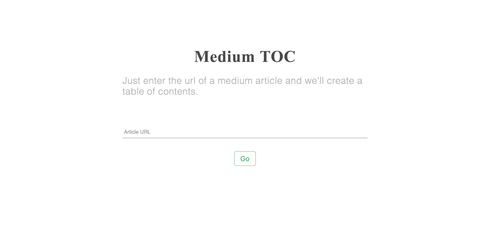
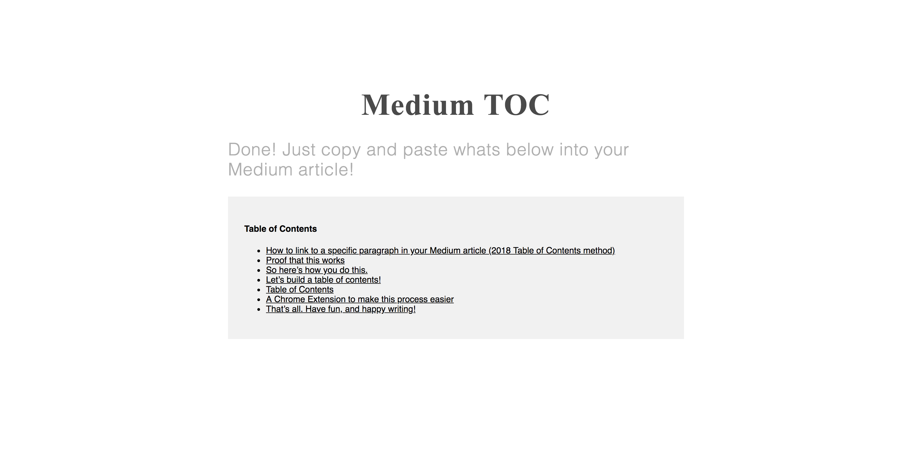

---

**Medium TOC** is a simple tool to generate tables of contents for Medium articles. Check it out: [www.mediumtoc.com](https://www.mediumtoc.com)

|  |  |
| -------------------------------- | ---------------------------------- |
| Enter A URL                      | Get The Contents                   |

## Installation

1. Clone: `git clone https://github.com/adamisntdead/medium-toc`
2. Install: `yarn install`
3. Start: `yarn start`

And your done! :sparkles:

## License

Copyright Adam Kelly 2020, MIT License.
